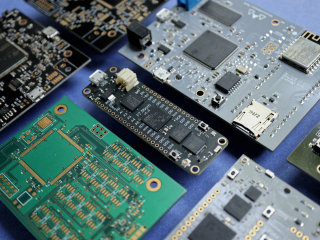
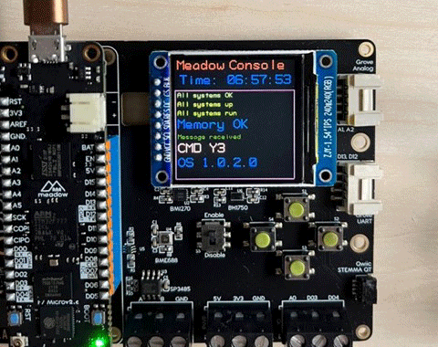

Graphics Console Demos for Meadow
=================================

This Visual Studio solution contains three examples of how to use the Belasoft Graphics Console on a [**meadow**](https://www.wildernesslabs.co/developers) board from [*Wilderness Labs*](https://www.wildernesslabs.co/). The **meadow** board must have a graphic display attached for this to work.

The examples uses the St7789 display, but although the console has not been tested on other graphic displays, it should work as long as the displays are based on the MicroGraphics class.

You can have the whole display being a console, part of the display being a console, or you can even have more than one console on the same display. 

Examples of Console in action
-----------------------------

Video showing one Console on St7789 display: https://www.youtube.com/shorts/e0oUps9HY1Y

Video showing two Consoles on St7789 display: https://www.youtube.com/shorts/ixaep6Anos4

Video showing three Consoles on St7789 display: https://www.youtube.com/watch?v=B-GKpX_ZmJ8

Installation steps
------------------

1. Install this NuGet package in your project file in Visual Studio: 

        Description of package and how to install

2. In the top of your MeadowApp.cs file add a using for the  Belasoft.MeadowLibrary:

        using Belasoft.MeadowLibrary;

3. Setup a display with MicroGraphics, for example the St7789:

        var display = new St7789
        (
            spiBus: MeadowApp.Device.CreateSpiBus(),
            chipSelectPin: Device.Pins.A03,
            dcPin: Device.Pins.A04,
            resetPin: Device.Pins.A05,
            width: 240, height: 240,
            colorMode: ColorMode.Format16bppRgb565
        );

        var graphics = new MicroGraphics(display)
        {
            Stroke = 1,
            CurrentFont = new Font8x12(),
            Rotation = RotationType._270Degrees
        };        

4. Setup a Console:

        GraphicsConsole gc = new GraphicsConsole(graphics, false);
        gc.YTop = 0;
        gc.YBottom = graphics.Height / 2;
        gc.Indent = 0;
        gc.IndentRight = 0;
        gc.BorderColor = Color.Violet;
        gc.SetBorder();        
        Thread t = new Thread(gc.Start);
        t.Start();

5. Begin writing texts to the console:
        
        gc.WriteLine("Initializing", Color.Red, ScaleFactor.X2, true);        
        gc.WriteLine("System starting...", Color.OrangeRed, ScaleFactor.X2, true);        
        gc.WriteLine("Warming up...", Color.Orange, ScaleFactor.X2, true);        
        gc.WriteLine("Comm ready", Color.Yellow, ScaleFactor.X2, true);
        gc.WriteLine("GO", Color.Green, ScaleFactor.X3, true);        

